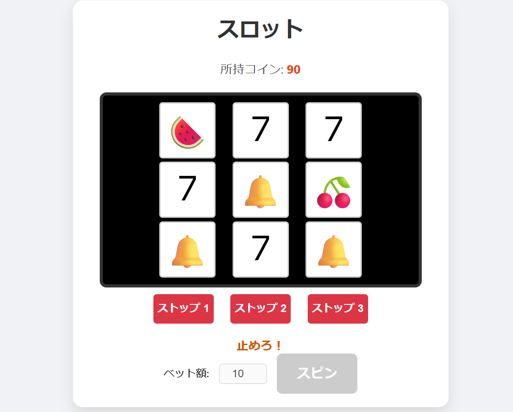

# 🎰 カスタムスロット（Custom Slot）

## 🕹 概要

「カスタムスロット」は、プレイヤーがスロットの出目を自由に設定できる、ブラウザで遊べる直感型のスロットゲームです。  

## 🌐 プレイはこちらから

👉 [https://96amegit.github.io/slot/](https://96amegit.github.io/slot/)

## 📌 特徴

- 自分だけの出目を自由に設定可能！
- シンプルな操作性で誰でもすぐ遊べる！
- 完全無料・インストール不要で、ブラウザですぐに遊べます！

## 🛠 技術スタック

- HTML / CSS / JavaScript
- GitHub Pages を利用してホスティング

## 📷 スクリーンショット

## &copy; 2024 くろあめ

---

くろあめ（[@kurounityame](https://twitter.com/kurounityame)）が開発 🚀  
ほかの作品はこちら → [https://96amegit.github.io/](https://96amegit.github.io/)
